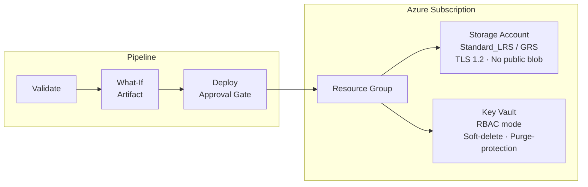

# ARM with Azure — Best Practice Example

Deploys a **Resource Group**, **Storage Account**, and **Key Vault** using ARM JSON templates at subscription scope.

**IaC tool:** Azure Resource Manager (ARM) JSON  
**Auth pattern:** Service Principal with Client Secret  
**Dry-run:** `az deployment sub what-if`

---

## Architecture



---

## Prerequisites

| Tool | Version |
|---|---|
| Azure CLI | ≥ 2.50 |
| jq | any |
| Azure Subscription | Owner or User Access Administrator |
| Azure DevOps | Org + Project + ability to create Service Connections |

---

## 1. Identity Setup

### Who
A **Service Principal with Client Secret** — the classic pattern for ARM.  
One SP per environment is recommended (`sp-arm-armdemo-dev`, `sp-arm-armdemo-prod`).

### What permissions

| Role | Scope | Why |
|---|---|---|
| `Contributor` | Subscription | Needed to create the Resource Group (subscription-scope deployment) |
| After first deploy you can narrow to `Contributor` on the RG only | RG | Principle of least privilege |

### How to create

```bash
# Run once per environment
bash scripts/create-service-principal.sh <subscription-id> dev eastus
bash scripts/create-service-principal.sh <subscription-id> prod eastus
```

The script outputs the credentials — save them into:
- **Azure DevOps Library** → Variable group `iac-arm-azure-secrets`
- **Azure DevOps Service Connection** named `sc-arm-azure-dev` / `sc-arm-azure-prod`
  - Type: *Azure Resource Manager > Service Principal (manual)*

---

## 2. Local CLI Execution

```bash
# 1. Authenticate as the Service Principal
export AZURE_CLIENT_ID="<appId>"
export AZURE_CLIENT_SECRET="<password>"
export AZURE_TENANT_ID="<tenant>"
export AZURE_SUBSCRIPTION_ID="<subscriptionId>"

az login \
  --service-principal \
  --username "$AZURE_CLIENT_ID" \
  --password "$AZURE_CLIENT_SECRET" \
  --tenant "$AZURE_TENANT_ID"

az account set --subscription "$AZURE_SUBSCRIPTION_ID"

# 2. Validate (syntax + schema, no Azure changes)
az deployment sub validate \
  --location eastus \
  --template-file infra/templates/main.json \
  --parameters @infra/parameters/dev.parameters.json

# 3. What-If (preview — no changes made)
az deployment sub what-if \
  --location eastus \
  --template-file infra/templates/main.json \
  --parameters @infra/parameters/dev.parameters.json

# 4. Deploy
az deployment sub create \
  --location eastus \
  --template-file infra/templates/main.json \
  --parameters @infra/parameters/dev.parameters.json \
  --name "arm-local-dev"

# 5. View outputs
az deployment sub show \
  --name "arm-local-dev" \
  --query "properties.outputs" \
  --output table
```

---

## 3. Azure DevOps Pipeline Execution

**Pipeline file:** [pipelines/azure-pipelines.yml](pipelines/azure-pipelines.yml)

### Setup checklist

- [ ] Create Library variable group `iac-arm-azure-secrets` with `AZURE_SUBSCRIPTION_ID`
- [ ] Create Service Connections `sc-arm-azure-dev` and `sc-arm-azure-prod`
- [ ] Create ADO Environments named `dev` and `prod`
- [ ] On the `prod` environment, add an **Approvals and checks → Approval** with required approvers
- [ ] Register this pipeline file in ADO

### Pipeline flow

| Stage | Trigger | What happens |
|---|---|---|
| **Validate** | Every push / PR | `az deployment sub validate` — fails fast on schema errors |
| **WhatIf** | After Validate | `az deployment sub what-if` — output saved as build artifact |
| **Deploy** | `main` branch only + approval | `az deployment sub create` — idempotent |

### Running manually with a parameter override

Trigger a manual run from ADO UI and select environment `prod`. The pipeline picks up `prod.parameters.json` automatically.

---

## 4. Variables Reference

| Parameter | Type | Dev default | Prod default | Description |
|---|---|---|---|---|
| `environment` | string | `dev` | `prod` | Appended to all resource names |
| `location` | string | `eastus` | `eastus` | Azure region |
| `projectName` | string | `armdemo` | `armdemo` | Short prefix (≤10 chars) |
| `storageSkuName` | string | `Standard_LRS` | `Standard_GRS` | Storage replication tier |
| `keyVaultSkuName` | string | `standard` | `premium` | Key Vault pricing tier |

---

## 5. Outputs

| Output | Description |
|---|---|
| `resourceGroupName` | Name of the created Resource Group |
| `storageAccountId` | Full resource ID of the Storage Account |
| `keyVaultUri` | HTTPS URI of the Key Vault (e.g. `https://kv-armdemo-dev.vault.azure.net/`) |

---

## 6. Cleanup

```bash
# Delete everything deployed by this template
az group delete \
  --name "rg-armdemo-dev-eastus" \
  --yes \
  --no-wait
```

> **Note:** Key Vault purge protection is enabled. Even after deleting the vault, it enters soft-delete state for 7 days. To permanently purge:
> ```bash
> az keyvault purge --name "kv-armdemo-dev" --location eastus
> ```

---

## Key Concepts Demonstrated

| Concept | Where |
|---|---|
| Subscription-scope deployment (`$schema: .../subscriptionDeploymentTemplate.json#`) | `infra/templates/main.json` |
| Linked/nested templates via `templateLink.relativePath` | `main.json` → `storage-account.json`, `key-vault.json` |
| `what-if` as audit artifact | `pipelines/azure-pipelines.yml` WhatIf stage |
| `deployment` job (not `job`) for ADO approval gates | `pipelines/azure-pipelines.yml` Deploy stage |
| RBAC-mode Key Vault (vs access policy mode) | `infra/templates/key-vault.json` |
| `uniqueString()` for globally unique storage account names | `infra/templates/main.json` variables |
