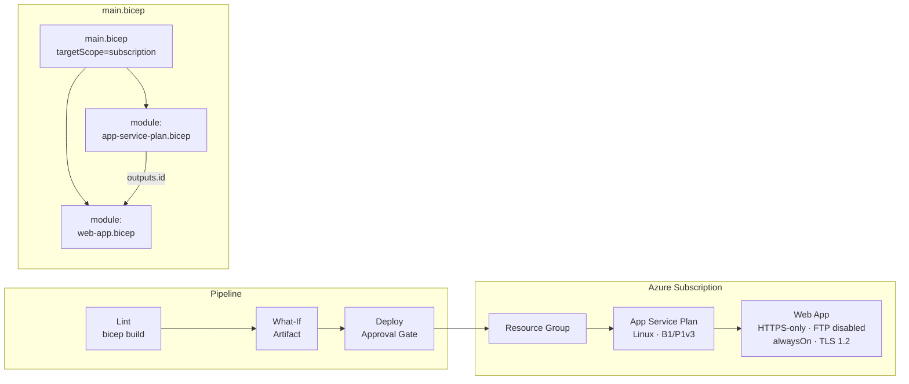

# Bicep with Azure — Best Practice Example

Deploys a **Resource Group**, **App Service Plan**, and **Web App** using modular Bicep at subscription scope.

**IaC tool:** Azure Bicep  
**Auth pattern:** Service Principal with OIDC / Workload Identity Federation (no client secret)  
**Dry-run:** `az deployment sub what-if`

---

## Architecture



---

## Prerequisites

| Tool | Version |
|---|---|
| Azure CLI | ≥ 2.50 |
| Bicep CLI | installed via `az bicep install` |
| Azure Subscription | Owner or User Access Administrator |
| Azure DevOps | Org + Project + ability to create Workload Identity Federation service connections |

---

## 1. Identity Setup

### Who
A **Service Principal with OIDC / Workload Identity Federation** — **no client secret stored anywhere**.  
This is the most secure pattern for Azure DevOps CI because:
- No secret to rotate or accidentally leak
- Token is short-lived and scoped to the specific pipeline run
- ADO and Entra ID exchange tokens automatically using OIDC

### What permissions

| Role | Scope | Why |
|---|---|---|
| `Contributor` | Subscription | Create Resource Group (subscription-scope deployment) |
| After first deploy, narrow to `Contributor` on RG | RG | Least privilege |

### How to create

```bash
# Install ADO CLI extension first
az extension add --name azure-devops
az devops configure --defaults organization=https://dev.azure.com/<YourOrg>

# Run once per environment
bash scripts/create-service-principal.sh \
  <subscription-id> dev MyOrg MyProject sc-bicep-oidc-dev

bash scripts/create-service-principal.sh \
  <subscription-id> prod MyOrg MyProject sc-bicep-oidc-prod
```

Then in Azure DevOps:
1. **Project Settings → Service Connections → New service connection**
2. Choose **Azure Resource Manager → Workload Identity Federation (manual)**
3. Enter the values printed by the script (Client ID, Tenant ID, Subscription ID)
4. Name the connection exactly `sc-bicep-oidc-dev` (or `prod`)

---

## 2. Local CLI Execution

> For local development, use interactive `az login` rather than OIDC (OIDC requires ADO pipeline context).

```bash
# 1. Login interactively (or use --service-principal for automation)
az login
az account set --subscription "<subscription-id>"

# 2. Install Bicep CLI (one-time)
az bicep install

# 3. Lint / compile (validates syntax)
az bicep build --file infra/main.bicep

# 4. What-If (preview — no changes made)
az deployment sub what-if \
  --location eastus \
  --template-file infra/main.bicep \
  --parameters infra/parameters/dev.bicepparam

# 5. Deploy
az deployment sub create \
  --location eastus \
  --template-file infra/main.bicep \
  --parameters infra/parameters/dev.bicepparam \
  --name "bicep-local-dev"

# 6. View outputs
az deployment sub show \
  --name "bicep-local-dev" \
  --query "properties.outputs" \
  --output table

# 7. Verify the web app is up
az webapp show \
  --resource-group "rg-bicepdemo-dev-eastus" \
  --name "<webAppName-from-outputs>" \
  --query "defaultHostName" \
  --output tsv
```

---

## 3. Azure DevOps Pipeline Execution

**Pipeline file:** [pipelines/azure-pipelines.yml](pipelines/azure-pipelines.yml)

### Setup checklist

- [ ] Run `create-service-principal.sh` for both `dev` and `prod`
- [ ] Create Library variable group `iac-bicep-azure-vars` with `LOCATION=eastus`, `PROJECT_NAME=bicepdemo`
- [ ] Create Service Connections `sc-bicep-oidc-dev` and `sc-bicep-oidc-prod` (Workload Identity Federation type)
- [ ] Create ADO Environments named `dev` and `prod`
- [ ] On `prod` environment, add an **Approvals and checks → Approval**
- [ ] Register this pipeline file in ADO

### Pipeline flow

| Stage | Trigger | What happens |
|---|---|---|
| **Lint** | Every push / PR | `az bicep build` — catches syntax errors, publishes compiled ARM JSON |
| **WhatIf** | After Lint | `az deployment sub what-if` — output saved as build artifact |
| **Deploy** | `main` branch only + approval | `az deployment sub create` — idempotent |

---

## 4. Variables Reference

| Parameter | Type | Dev | Prod | Description |
|---|---|---|---|---|
| `environment` | string | `dev` | `prod` | Appended to all resource names |
| `location` | string | `eastus` | `eastus` | Azure region |
| `projectName` | string | `bicepdemo` | `bicepdemo` | Short prefix (≤10 chars) |
| `appServicePlanSku` | string | `B1` | `P1v3` | App Service Plan pricing tier |
| `runtimeStack` | string | `NODE\|20-lts` | `NODE\|20-lts` | Linux FX version |

---

## 5. Outputs

| Output | Description |
|---|---|
| `resourceGroupName` | Name of the created Resource Group |
| `appServicePlanId` | Full resource ID of the App Service Plan |
| `webAppName` | Name of the Web App |
| `webAppUrl` | Public HTTPS URL (e.g. `https://bicepdemo-dev-xxxx.azurewebsites.net`) |

---

## 6. Cleanup

```bash
az group delete \
  --name "rg-bicepdemo-dev-eastus" \
  --yes \
  --no-wait
```

---

## Key Concepts Demonstrated

| Concept | Where |
|---|---|
| `targetScope = 'subscription'` | `infra/main.bicep` top line |
| Bicep module keyword | `main.bicep` → `modules/app-service-plan.bicep` + `modules/web-app.bicep` |
| Module output chaining (no hardcoding) | `appPlan.outputs.id` passed to `webApp` params |
| OIDC Workload Identity Federation (no secret) | `scripts/create-service-principal.sh` + ADO service connection |
| `az bicep build` lint step in CI | `pipelines/azure-pipelines.yml` Lint stage |
| `.bicepparam` files (typed parameter files) | `infra/parameters/dev.bicepparam` |
| Compiled ARM JSON published as artifact | Lint stage `PublishBuildArtifacts` |
