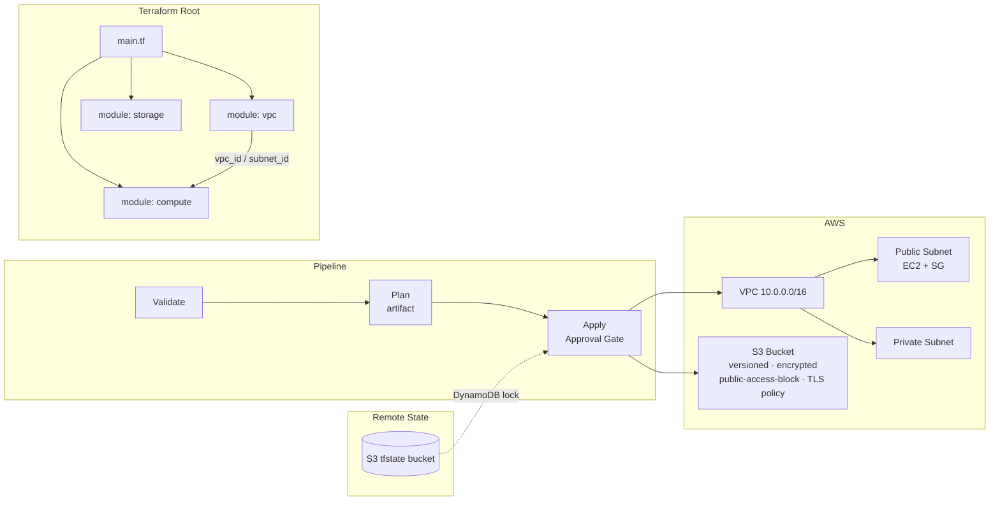

# Terraform with AWS — Best Practice Example

Deploys a **VPC**, **public + private subnets**, **EC2 instance**, and **S3 bucket** using Terraform with S3 + DynamoDB remote state.

**IaC tool:** Terraform ≥ 1.7  
**Auth pattern:** IAM User with Access Key (local) / IAM Role + OIDC (CI)  
**Remote state:** S3 bucket + DynamoDB table for state locking  

---

## Architecture



---

## Prerequisites

| Tool | Version |
|---|---|
| Terraform | ≥ 1.7 |
| AWS CLI | ≥ 2.x |
| jq | any |
| AWS Account | IAM permissions to create users, roles, EC2, VPC, S3, DynamoDB |
| Azure DevOps | Org + Project (for pipeline) |

---

## 1. Identity Setup

### Two patterns — use both to learn the difference

#### Pattern A: IAM User with Access Key (local development)

Simple, classic pattern. Not recommended for production CI/CD because secrets must be stored.

#### Pattern B: IAM Role with OIDC (CI/CD — advanced)

Azure DevOps can assume an AWS IAM Role using OIDC token exchange — **no access key stored in ADO**. See the OIDC section below.

---

### Pattern A — IAM User

#### What permissions (least-privilege)

The IAM policy grants only:
- EC2/VPC/Subnet/SG/instance operations
- S3 on buckets prefixed `demo-data-*`
- S3 read/write on the TF state bucket only
- DynamoDB GetItem/PutItem/DeleteItem on the lock table only

#### How to create

```bash
# Step 1: Bootstrap backend first
bash scripts/bootstrap-backend.sh <aws-account-id> dev us-east-1

# Step 2: Create IAM user with least-privilege policy
bash scripts/create-iam-user.sh dev \
  tfstate-<account-id>-dev \
  tf-state-lock-dev
```

The script prints `AWS_ACCESS_KEY_ID` and `AWS_SECRET_ACCESS_KEY`.

---

### Pattern B — IAM Role with OIDC (for Azure DevOps CI)

```bash
# Get your ADO org OIDC issuer URL
# Format: https://vstoken.dev.azure.com/<ORG_GUID>
# (check: Organization Settings → Azure Active Directory → Tenant ID)

# Create OIDC Identity Provider in AWS IAM
aws iam create-open-id-connect-provider \
  --url "https://vstoken.dev.azure.com/<ORG_GUID>" \
  --client-id-list "api://AzureADTokenExchange" \
  --thumbprint-list "0000000000000000000000000000000000000000"

# Create IAM Role with trust policy for the ADO service connection
aws iam create-role \
  --role-name "tf-ado-oidc-dev" \
  --assume-role-policy-document '{
    "Version": "2012-10-17",
    "Statement": [{
      "Effect": "Allow",
      "Principal": {
        "Federated": "arn:aws:iam::<ACCOUNT_ID>:oidc-provider/vstoken.dev.azure.com/<ORG_GUID>"
      },
      "Action": "sts:AssumeRoleWithWebIdentity",
      "Condition": {
        "StringEquals": {
          "vstoken.dev.azure.com/<ORG_GUID>:sub": "sc://<ORG>/<PROJECT>/<SERVICE_CONNECTION_NAME>"
        }
      }
    }]
  }'

# Attach the same least-privilege policy to the role
aws iam put-role-policy \
  --role-name "tf-ado-oidc-dev" \
  --policy-name "TerraformAWSPolicy-dev" \
  --policy-document file://iam-policy.json
```

---

## 2. Local CLI Execution

```bash
# 1. Export credentials
export AWS_ACCESS_KEY_ID="<key>"
export AWS_SECRET_ACCESS_KEY="<secret>"
export AWS_DEFAULT_REGION="us-east-1"

cd infra/

# 2. Bootstrap backend (once per environment)
# Already done via bootstrap-backend.sh

# 3. Initialize
terraform init \
  -backend-config="bucket=tfstate-<account-id>-dev" \
  -backend-config="key=aws-demo/dev.tfstate" \
  -backend-config="region=us-east-1" \
  -backend-config="dynamodb_table=tf-state-lock-dev" \
  -backend-config="encrypt=true" \
  -reconfigure

# 4. Validate
terraform validate

# 5. Plan
terraform plan \
  -var-file="environments/dev.tfvars" \
  -out=tfplan

# 6. Apply
terraform apply tfplan

# 7. View outputs
terraform output

# 8. SSH to EC2 (if key pair configured)
EC2_IP=$(terraform output -raw ec2_public_ip)
echo "EC2 public IP: $EC2_IP"

# 9. Destroy
terraform destroy -var-file="environments/dev.tfvars"
```

---

## 3. Azure DevOps Pipeline Execution

**Pipeline file:** [pipelines/azure-pipelines.yml](pipelines/azure-pipelines.yml)

### Setup checklist

- [ ] Run `bootstrap-backend.sh` for both environments
- [ ] Run `create-iam-user.sh` for both environments (or set up OIDC role)
- [ ] Create Library variable group `iac-tf-aws-secrets`:
  - `AWS_ACCESS_KEY_ID` — mark as **Secret (locked)**
  - `AWS_SECRET_ACCESS_KEY` — mark as **Secret (locked)**
- [ ] Create Library variable group `iac-tf-aws-backend`:
  - `TF_BACKEND_BUCKET`, `TF_BACKEND_REGION`, `TF_BACKEND_DYNAMODB`
- [ ] Create ADO Environments `aws-dev` and `aws-prod`; add approval gate on `aws-prod`
- [ ] Register this pipeline in ADO

### Pipeline flow

| Stage | Trigger | What happens |
|---|---|---|
| **Validate** | Every push / PR | `terraform init -reconfigure` + `terraform validate` |
| **Plan** | After Validate | `terraform plan -out=tfplan` → published as artifact |
| **Apply** | `main` + action=apply + approval | Downloads plan artifact → `terraform apply` |
| **Destroy** | `main` + action=destroy + approval | `terraform destroy -auto-approve` |

### Secret injection pattern

AWS secrets are injected via `env:` block **on individual steps only** — not set as pipeline-level variables. This limits exposure: secrets are only available to the step that needs them and are masked in logs by ADO.

```yaml
- script: terraform apply ...
  env:
    AWS_ACCESS_KEY_ID: $(AWS_ACCESS_KEY_ID)       # only here
    AWS_SECRET_ACCESS_KEY: $(AWS_SECRET_ACCESS_KEY) # only here
```

---

## 4. Variables Reference

| Variable | Type | Dev | Prod | Description |
|---|---|---|---|---|
| `aws_region` | string | `us-east-1` | `us-east-1` | AWS region |
| `environment` | string | `dev` | `prod` | Appended to all resource names |
| `project_name` | string | `awsdemo` | `awsdemo` | Short prefix (lowercase, ≤10 chars) |
| `vpc_cidr` | string | `10.0.0.0/16` | `10.1.0.0/16` | VPC CIDR block |
| `public_subnet_cidr` | string | `10.0.1.0/24` | `10.1.1.0/24` | Public subnet CIDR |
| `private_subnet_cidr` | string | `10.0.2.0/24` | `10.1.2.0/24` | Private subnet CIDR |
| `ec2_instance_type` | string | `t3.micro` | `t3.small` | EC2 instance size |
| `allowed_ssh_cidr` | string | `0.0.0.0/0` | `10.0.0.0/8` | CIDR allowed to SSH (restrict in prod!) |
| `s3_bucket_name_prefix` | string | `demo-data` | `demo-data` | S3 bucket name prefix |

---

## 5. Outputs

| Output | Description |
|---|---|
| `vpc_id` | ID of the VPC |
| `public_subnet_id` | ID of the public subnet |
| `private_subnet_id` | ID of the private subnet |
| `ec2_instance_id` | EC2 instance ID |
| `ec2_public_ip` | Public IP of the EC2 instance |
| `s3_bucket_name` | Name of the S3 data bucket |
| `s3_bucket_arn` | ARN of the S3 data bucket |

---

## 6. Cleanup

```bash
# From infra/ with AWS credentials exported:
terraform destroy -var-file="environments/dev.tfvars"
```

> **Note:** The S3 bucket has versioning enabled — `terraform destroy` will delete the bucket, but AWS may retain delete markers. If destroy fails due to non-empty bucket:
> ```bash
> aws s3 rm s3://<bucket-name> --recursive
> terraform destroy -var-file="environments/dev.tfvars"
> ```

---

## Key Concepts Demonstrated

| Concept | Where |
|---|---|
| `data "aws_ami"` to pin latest AMI without hardcoding | `modules/compute/main.tf` |
| IMDSv2-only (`http_tokens = "required"`) | `modules/compute/main.tf` metadata_options |
| S3 bucket policy enforcing TLS (`aws:SecureTransport`) | `modules/storage/main.tf` |
| `random_id` suffix for globally unique S3 names | `modules/storage/main.tf` |
| S3 backend + DynamoDB state locking | `backend.tf` + `bootstrap-backend.sh` |
| Secrets injected via `env:` block (not pipeline variables) | `pipelines/azure-pipelines.yml` |
| IAM User vs OIDC Role patterns both documented | `scripts/` + README |
| `provider "aws"` `default_tags` block (tags on all resources) | `versions.tf` |
