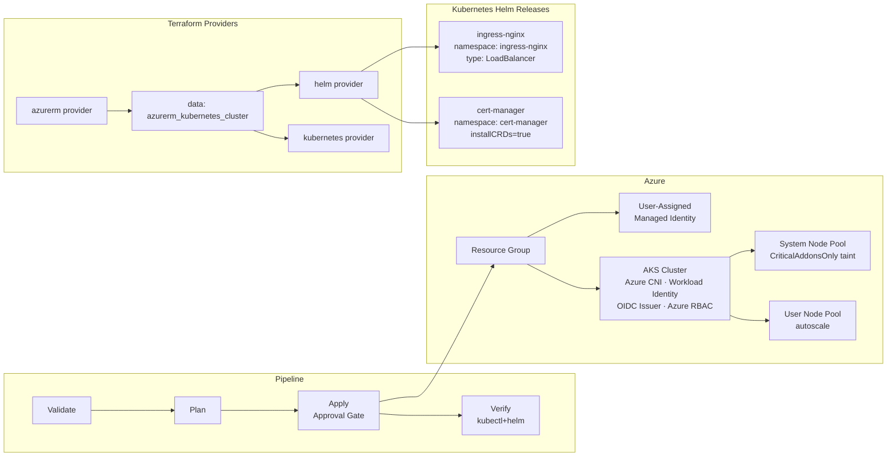

# Terraform with Azure & AKS + Helm — Best Practice Example

Deploys an **AKS cluster** (system + user node pools) and installs **nginx-ingress** and **cert-manager** via the Terraform Helm provider — all in a single `terraform apply`.

**IaC tool:** Terraform ≥ 1.7 (providers: azurerm + helm + kubernetes)  
**Auth pattern:** Two separate identities (infra SP + AKS managed identity)  
**Remote state:** Azure Blob Storage + blob lease  
**Key pattern:** Helm provider fed from data source — no kubeconfig file written to disk  

---

## Architecture



---

## Prerequisites

| Tool | Version |
|---|---|
| Terraform | ≥ 1.7 |
| Azure CLI | ≥ 2.50 |
| kubectl | any (for local verification) |
| Helm CLI | ≥ 3.x (for local verification) |
| Azure Subscription | Owner (to assign roles to managed identity) |
| Azure DevOps | Org + Project + Service Connection |

---

## 1. Identity Setup

### Two identities — why they're separate

| Identity | Type | Purpose |
|---|---|---|
| **TF Service Principal** | SP with Client Secret | Runs Terraform: creates AKS, RG, managed identity, reads state |
| **AKS Managed Identity** | User-Assigned Managed Identity | The cluster's own identity for Azure API calls (pulling ACR images, managing node pools, Azure CNI) |

Separating them means the Terraform SP only needs `Managed Identity Operator` (to assign the identity to AKS) — **not `Owner`** on the RG. This is least-privilege.

### TF Service Principal — permissions

| Role | Scope | Why |
|---|---|---|
| `Contributor` | Target Resource Group | Create/manage AKS, VNet, managed identity |
| `Managed Identity Operator` | Target Resource Group | Assign managed identity to AKS |
| `Storage Blob Data Contributor` | Backend Storage Account | Read/write Terraform state |

### How to create

```bash
# Step 1: Bootstrap backend storage
bash scripts/bootstrap-backend.sh <subscription-id> dev eastus

# Step 2: Create SP with correct roles
bash scripts/create-service-principal.sh \
  <subscription-id> dev \
  rg-tfstate-aks-dev-eastus \
  <backend-storage-account-name>
```

### ADO Setup

- Library variable group `iac-aks-azure-backend`: `BACKEND_SA_NAME`, `BACKEND_RG`, `BACKEND_CONTAINER`
- Service connection `sc-aks-azure-dev` and `sc-aks-azure-prod`: *Azure Resource Manager → Service Principal (manual)*
- ADO Environments `aks-dev` and `aks-prod` with approval gate on `aks-prod`

---

## 2. Local CLI Execution

```bash
# 1. Export SP credentials
export ARM_CLIENT_ID="<appId>"
export ARM_CLIENT_SECRET="<password>"
export ARM_TENANT_ID="<tenant>"
export ARM_SUBSCRIPTION_ID="<subscriptionId>"

cd infra/

# 2. Initialize backend
terraform init \
  -backend-config="storage_account_name=<BACKEND_SA>" \
  -backend-config="container_name=tfstate" \
  -backend-config="key=aks/dev.tfstate" \
  -backend-config="resource_group_name=<BACKEND_RG>" \
  -reconfigure

# 3. Validate
terraform validate

# 4. Plan
terraform plan \
  -var-file="environments/dev.tfvars" \
  -out=tfplan

# 5. Apply (creates AKS + installs Helm releases)
terraform apply tfplan

# 6. Get kubeconfig for local access
bash ../scripts/get-kubeconfig.sh dev

# 7. Verify
kubectl get nodes
kubectl get pods -A
helm list -A

# 8. Check nginx-ingress LoadBalancer IP
kubectl get svc -n ingress-nginx

# 9. Destroy when done
terraform destroy -var-file="environments/dev.tfvars"
```

---

## 3. Azure DevOps Pipeline Execution

**Pipeline file:** [pipelines/azure-pipelines.yml](pipelines/azure-pipelines.yml)

### Pipeline flow

| Stage | Trigger | What happens |
|---|---|---|
| **Validate** | Every push / PR | `terraform init -reconfigure` + `terraform validate` |
| **Plan** | After Validate | `terraform plan -out=tfplan` covering AKS + Helm → artifact |
| **Apply** | `main` + action=apply + approval | Downloads plan → `terraform apply` (AKS first, then Helm via dependency graph) |
| **Verify** | After Apply | `kubectl wait nodes`, `kubectl rollout status` nginx-ingress + cert-manager, `helm list -A` |
| **Destroy** | `main` + action=destroy + approval | `terraform destroy` (Helm releases destroyed first, then AKS, then RG) |

### How Helm releases are verified in CI

```yaml
- task: AzureCLI@2
  inputs:
    azureSubscription: $(serviceConnection)
    inlineScript: |
      az aks install-cli              # installs kubectl on agent
      az aks get-credentials ...      # uses SP creds — no stored kubeconfig
      kubectl wait --for=condition=Ready nodes --all --timeout=180s
      kubectl rollout status deployment/ingress-nginx-controller -n ingress-nginx
      helm list -A
```

---

## 4. Variables Reference

| Variable | Type | Dev | Prod | Description |
|---|---|---|---|---|
| `environment` | string | `dev` | `prod` | Appended to all resource names |
| `location` | string | `eastus` | `eastus` | Azure region |
| `project_name` | string | `aksdemo` | `aksdemo` | Short prefix (≤8 chars) |
| `kubernetes_version` | string | `1.30` | `1.30` | AKS Kubernetes version |
| `system_node_vm_size` | string | `Standard_D2s_v3` | `Standard_D4s_v3` | System pool VM size |
| `user_node_vm_size` | string | `Standard_D2s_v3` | `Standard_D4s_v3` | User pool VM size |
| `system_node_count_min/max` | number | 1/3 | 2/5 | System pool autoscale bounds |
| `user_node_count_min/max` | number | 1/3 | 2/10 | User pool autoscale bounds |
| `nginx_ingress_chart_version` | string | `4.10.1` | `4.10.1` | Pinned chart version |
| `cert_manager_chart_version` | string | `1.15.1` | `1.15.1` | Pinned chart version |

---

## 5. Outputs

| Output | Sensitive | Description |
|---|---|---|
| `resource_group_name` | No | Name of the AKS Resource Group |
| `aks_cluster_name` | No | Name of the AKS cluster |
| `aks_cluster_id` | No | Full resource ID of the AKS cluster |
| `cluster_fqdn` | No | API server FQDN |
| `kube_config` | **Yes** | Raw kubeconfig (never printed by default) |
| `nginx_ingress_namespace` | No | `ingress-nginx` |
| `cert_manager_namespace` | No | `cert-manager` |

---

## 6. Cleanup

```bash
# From infra/ with ARM_* env vars set:
terraform destroy -var-file="environments/dev.tfvars"
```

Terraform's dependency graph destroys in the correct order:
1. Helm releases (`helm_release`) — uninstalls nginx-ingress + cert-manager
2. Kubernetes namespaces
3. AKS cluster (`azurerm_kubernetes_cluster`)
4. User-assigned managed identity
5. Resource Group

---

## Key Concepts Demonstrated

| Concept | Where |
|---|---|
| Two-identity model (infra SP ≠ AKS managed identity) | `main.tf` + `scripts/create-service-principal.sh` |
| User-assigned managed identity pre-created before AKS | `main.tf` `azurerm_user_assigned_identity` |
| Helm + Kubernetes providers fed from data source (no kubeconfig file) | `providers.tf` |
| `depends_on` on data source to enforce provider ordering | `providers.tf` data block |
| `atomic = true` on Helm releases (auto rollback on failure) | `modules/helm-releases/main.tf` |
| `lifecycle { ignore_changes = [node_count] }` for autoscaler | `modules/aks/main.tf` |
| System pool taint `CriticalAddonsOnly=true:NoSchedule` | `modules/aks/main.tf` |
| `workload_identity_enabled + oidc_issuer_enabled` | `modules/aks/main.tf` |
| Azure RBAC mode (`azure_rbac_enabled`) instead of kubeconfig certs | `modules/aks/main.tf` |
| Post-deploy Verify stage in pipeline | `pipelines/azure-pipelines.yml` |
| `az aks install-cli` to get kubectl on pipeline agent | Verify stage |
| `kube_config` output marked `sensitive = true` | `outputs.tf` |
