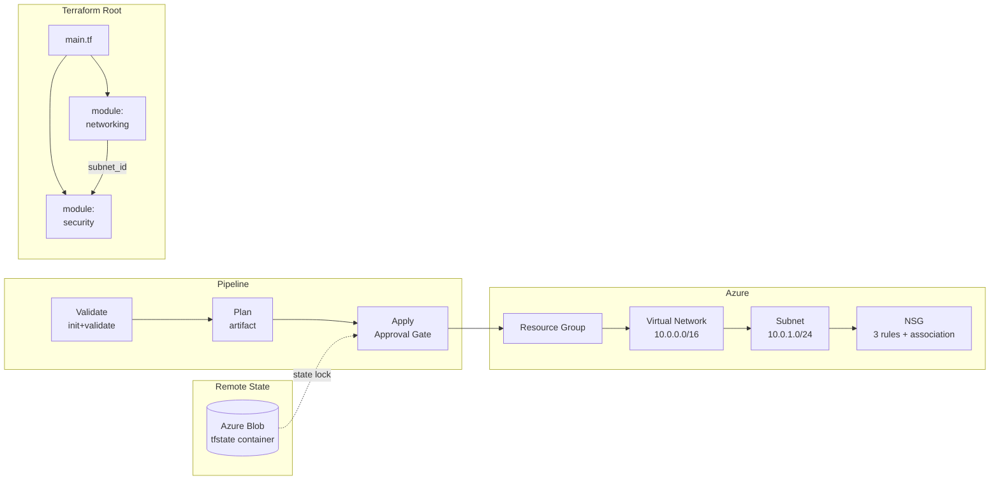

# Terraform with Azure — Best Practice Example

Deploys a **Resource Group**, **Virtual Network**, **Subnet**, and **NSG** using Terraform with modular structure and Azure Blob remote state.

**IaC tool:** Terraform ≥ 1.7  
**Auth pattern:** Service Principal with Client Secret (ARM env vars)  
**Remote state:** Azure Blob Storage + blob lease for state locking  

---

## Architecture



---

## Prerequisites

| Tool | Version |
|---|---|
| Terraform | ≥ 1.7 |
| Azure CLI | ≥ 2.50 |
| jq | any |
| Azure Subscription | Owner or User Access Administrator |
| Azure DevOps | Org + Project + Service Connection |

---

## 1. Identity Setup

### Who

A **Service Principal with Client Secret**.  
Terraform uses the `ARM_*` environment variables to authenticate — no `az login` needed.

### What permissions

| Role | Scope | Why |
|---|---|---|
| `Contributor` | Target Resource Group | Create/manage VNet, Subnet, NSG, and the RG itself |
| `Storage Blob Data Contributor` | Backend Storage Account | Read/write Terraform state file |

> **Why not subscription-level Contributor?** Scoping to the RG means the SP cannot touch other resource groups in the subscription — least privilege.

### Step 1 — Bootstrap the backend storage

```bash
# Creates: rg-tfstate-dev-eastus + storage account + tfstate container
bash scripts/bootstrap-backend.sh <subscription-id> dev eastus
bash scripts/bootstrap-backend.sh <subscription-id> prod eastus
```

### Step 2 — Create the Service Principal

```bash
bash scripts/create-service-principal.sh \
  <subscription-id> dev \
  rg-tfstate-dev-eastus \
  <backend-storage-account-name>
```

The script prints the ARM env vars and ADO setup instructions.

### Step 3 — ADO setup

- Library variable group `iac-tf-azure-backend`: `BACKEND_SA_NAME`, `BACKEND_RG`, `BACKEND_CONTAINER`
- Service connection `sc-tf-azure-dev` (and `prod`): *Azure Resource Manager → Service Principal (manual)*

---

## 2. Local CLI Execution

```bash
# 1. Export SP credentials as ARM env vars
export ARM_CLIENT_ID="<appId>"
export ARM_CLIENT_SECRET="<password>"
export ARM_TENANT_ID="<tenant>"
export ARM_SUBSCRIPTION_ID="<subscriptionId>"

cd infra/

# 2. Initialize backend (run once, or when switching environments)
terraform init \
  -backend-config="storage_account_name=<BACKEND_SA>" \
  -backend-config="container_name=tfstate" \
  -backend-config="key=networking/dev.tfstate" \
  -backend-config="resource_group_name=<BACKEND_RG>" \
  -reconfigure

# 3. Validate
terraform validate

# 4. Plan (saves binary plan file)
terraform plan \
  -var-file="environments/dev.tfvars" \
  -out=tfplan

# 5. Apply (uses the exact plan — no surprises)
terraform apply tfplan

# 6. Show outputs
terraform output

# 7. Destroy (when done)
terraform destroy -var-file="environments/dev.tfvars"
```

---

## 3. Azure DevOps Pipeline Execution

**Pipeline file:** [pipelines/azure-pipelines.yml](pipelines/azure-pipelines.yml)

### Setup checklist

- [ ] Run `bootstrap-backend.sh` for both environments
- [ ] Run `create-service-principal.sh` for both environments
- [ ] Create Library variable group `iac-tf-azure-backend` with backend values
- [ ] Create Service Connections `sc-tf-azure-dev` and `sc-tf-azure-prod`
- [ ] Create ADO Environments `dev` and `prod`; add approval gate on `prod`
- [ ] Register this pipeline in ADO

### Pipeline flow

| Stage | Trigger | What happens |
|---|---|---|
| **Validate** | Every push / PR | `terraform init -reconfigure` + `terraform validate` |
| **Plan** | After Validate | `terraform plan -out=tfplan` → published as artifact |
| **Apply** | `main` branch + action=apply + approval | Downloads exact plan artifact → `terraform apply` |
| **Destroy** | `main` branch + action=destroy + approval | `terraform destroy -auto-approve` |

### Key pipeline patterns

- `addSpnToEnvironment: true` — injects `$servicePrincipalId`, `$servicePrincipalKey`, `$tenantId` into script scope; mapped to `ARM_*` vars
- `TF_IN_AUTOMATION=true` — disables interactive prompts in Terraform output
- `-reconfigure` on every `init` — avoids stale backend config when agents are shared across runs
- Plan artifact downloaded in Apply stage → same binary plan the reviewer saw

---

## 4. Variables Reference

| Variable | Type | Dev | Prod | Description |
|---|---|---|---|---|
| `environment` | string | `dev` | `prod` | Appended to all resource names |
| `location` | string | `eastus` | `eastus` | Azure region |
| `project_name` | string | `tfdemo` | `tfdemo` | Short prefix (lowercase, ≤10 chars) |
| `vnet_address_space` | list | `["10.0.0.0/16"]` | `["10.1.0.0/16"]` | VNet CIDR blocks |
| `subnet_address_prefix` | string | `10.0.1.0/24` | `10.1.1.0/24` | Subnet CIDR |
| `tags` | map | see tfvars | see tfvars | Extra tags merged with defaults |

---

## 5. Outputs

| Output | Description |
|---|---|
| `resource_group_name` | Name of the Resource Group |
| `vnet_id` | Resource ID of the Virtual Network |
| `vnet_name` | Name of the Virtual Network |
| `subnet_id` | Resource ID of the default Subnet |
| `nsg_id` | Resource ID of the Network Security Group |

---

## 6. Cleanup

```bash
# From infra/ directory with ARM_* env vars set:
terraform destroy -var-file="environments/dev.tfvars"

# Or delete the resource group directly (faster, skips TF state update)
az group delete --name "rg-tfdemo-dev-eastus" --yes --no-wait
```

---

## Key Concepts Demonstrated

| Concept | Where |
|---|---|
| Partial backend config (`-backend-config` flags, no hardcoding) | `infra/backend.tf` + pipeline init step |
| Module composition with output chaining | `main.tf` → `modules/networking` → `modules/security` |
| `-reconfigure` to switch backends on shared agents | Every pipeline `terraform init` |
| `TF_IN_AUTOMATION=true` to suppress interactive output | Pipeline variable |
| Plan artifact → apply pattern (no drift) | Plan stage → Apply stage |
| `addSpnToEnvironment: true` to inject SP creds | `AzureCLI@2` task inputs |
| `deployment` job for ADO approval gates | Apply + Destroy stages |
| Variable validation blocks | `infra/variables.tf` |
