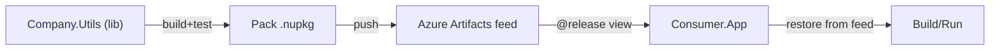

# ✍🏻 **.NET → Azure Artifacts → Consume (End-to-End)**

## 🗺️ **Big picture**



---

### 📃 **What this demo include?**

- Create a **.NET class library** with **proper NuGet metadata**
- **Pack** and **publish** to **Azure Artifacts** (securely via YAML)
- **Consume** the package from another app locally and in CI
- **Views & promotion** to protect downstream teams

---

## 🪜 **How to use them (quick start)**

### 1️⃣ **Publish the package (producer)**

1. Open `company-utils` Project.
2. Update the feed name in `azure-pipelines.yml`:

   - Replace `team-utils` with your **Azure Artifacts feed** name.

3. Push the repo to your Azure DevOps project and run the pipeline:

   - It will **build, test, pack**, and **push** `Company.Utils` to your feed with version `1.0.<BuildId>`.

4. (Optional local check)

   ```bash
   dotnet restore
   dotnet test -c Release
   dotnet pack Company.Utils/Company.Utils.csproj -c Release -o ./.artifacts
   # Optional push (requires PAT): dotnet nuget push ./.artifacts/Company.Utils.*.nupkg --source team-utils --api-key azdo --skip-duplicate
   ```

### 3️⃣ **Consume in MVC app (consumer)**

1. Open `consumer-mvc` Project.
2. Edit `NuGet.config`:

   - Replace `ORG`, `PROJECT`, and `team-utils` with your values.

3. Make sure the package exists in the feed (from step 1). In `Consumer.App.csproj` we reference:

   ```xml
   <PackageReference Include="Company.Utils" Version="1.0.*" />
   ```

   You can pin an exact version if you like.

4. Run it:

   ```bash
   dotnet restore
   dotnet run --project Consumer.App/Consumer.App.csproj
   ```

5. Browse to `http://localhost:5000` (or HTTPS port shown).
   You should see:

   - **Original**: “Hello from Azure Artifacts and Company.Utils!”
   - **TakeFirst(5)**: **Hello** ✅

---

## ⚙️ **Customize**

- **Change package metadata**: `Company.Utils.csproj` (PackageId, Description, License).
- **Add more APIs** in `StringTools.cs` and republish—your MVC app will pick them up after updating the version.
- **Use Views** in the feed (`@local`, `@release`) to promote safe versions to consumers.
