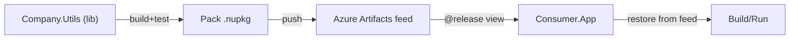

# ✍🏻 **.NET → Azure Artifacts → Consume (End-to-End)**

## 🗺️ **Big picture**



---

### 📃 **What this demo include?**

- Create a **.NET class library** with **proper NuGet metadata**
- **Pack** and **publish** to **Azure Artifacts** (securely via YAML)
- **Consume** the package from another app locally and in CI
- **Views & promotion** to protect downstream teams

---

## 🧰 Prerequisites

- .NET 8 SDK installed.
- Azure DevOps org + project.
- An Azure Artifacts **feed** (e.g., `team-utils`) already created.
- You have **Contributor** rights on the feed.

---

## **1. Create a reusable library (Class Library)**

```bash
mkdir dotnet-pack-demo && cd dotnet-pack-demo
dotnet new sln -n PackDemo
dotnet new classlib -n Company.Utils
dotnet sln add Company.Utils/Company.Utils.csproj
```

Add a tiny reusable API:

**Company.Utils/StringTools.cs:**

```csharp
namespace Company.Utils;

public static class StringTools
{
    /// <summary>
    /// Returns the first N characters; if text is shorter, returns text unchanged.
    /// </summary>
    public static string TakeFirst(string text, int count)
        => string.IsNullOrEmpty(text) || count <= 0
            ? string.Empty
            : (text.Length <= count ? text : text[..count]);
}
```

### Add NuGet package metadata (VERY IMPORTANT)

Edit **Company.Utils/Company.Utils.csproj**:

```xml
<Project Sdk="Microsoft.NET.Sdk">

  <PropertyGroup>
    <TargetFramework>net8.0</TargetFramework>

    <!-- NuGet metadata -->
    <PackageId>Company.Utils</PackageId>
    <Version>1.0.0</Version>                <!-- or set by CI -->
    <Authors>Your Team</Authors>
    <Company>Your Company</Company>
    <Description>Utility helpers for strings and collections.</Description>
    <PackageTags>utilities;strings;helpers</PackageTags>
    <RepositoryUrl>https://dev.azure.com/ORG/PROJECT/_git/repo</RepositoryUrl>
    <PackageProjectUrl>https://dev.azure.com/ORG/PROJECT</PackageProjectUrl>
    <PackageLicenseExpression>MIT</PackageLicenseExpression>
    <IncludeSymbols>true</IncludeSymbols>
    <SymbolPackageFormat>snupkg</SymbolPackageFormat>
    <GenerateDocumentationFile>true</GenerateDocumentationFile>

    <!-- Optional: SourceLink for nicer debugging -->
    <PublishRepositoryUrl>true</PublishRepositoryUrl>
    <EmbedUntrackedSources>true</EmbedUntrackedSources>
    <ContinuousIntegrationBuild>true</ContinuousIntegrationBuild>
  </PropertyGroup>

  <ItemGroup>
    <PackageReference Include="Microsoft.SourceLink.GitHub" Version="8.0.0" PrivateAssets="All" />
  </ItemGroup>

</Project>
```

> James-Lee-tip: **Package metadata** is exam-worthy and real-world critical (discoverability + trust).

---

## **2. Add unit tests (so we pack only proven builds)**

```bash
dotnet new xunit -n Company.Utils.Tests
dotnet sln add Company.Utils.Tests/Company.Utils.Tests.csproj
dotnet add Company.Utils.Tests reference Company.Utils/Company.Utils.csproj
```

**Company.Utils.Tests/StringToolsTests.cs:**

```csharp
using Company.Utils;
using Xunit;

public class StringToolsTests
{
    [Theory]
    [InlineData("HelloWorld", 5, "Hello")]
    [InlineData("Hi", 5, "Hi")]
    [InlineData("", 3, "")]
    public void TakeFirst_Works(string input, int count, string expected)
        => Assert.Equal(expected, StringTools.TakeFirst(input, count));
}
```

Run it:

```bash
dotnet test
```

---

## **3. Pack the NuGet locally (dry run)**

```bash
dotnet pack Company.Utils/Company.Utils.csproj -c Release -o ./.artifacts
```

You should see a `.nupkg` and `.snupkg` in `./.artifacts`. Great.

---

## **4. Connect to your Azure Artifacts feed (local dev optional)**

Get the feed’s NuGet v3 index URL from **Artifacts → Connect to Feed**:

```ini
https://pkgs.dev.azure.com/ORG/PROJECT/_packaging/team-utils/nuget/v3/index.json
```

Add as a source (dev box):

```bash
dotnet nuget add source "https://pkgs.dev.azure.com/ORG/PROJECT/_packaging/team-utils/nuget/v3/index.json" \
  --name team-utils
```

> In CI, we won’t hardcode creds; we’ll use the **NuGetAuthenticate** task.

---

## **5. Publish the package (CI recommended; here’s the CLI too)**

**CLI (PAT required, not recommended for CI):**

```bash
dotnet nuget push "./.artifacts/Company.Utils.1.0.0.nupkg" \
  --source "team-utils" \
  --api-key azdo \
  --skip-duplicate
```

> Prefer CI pipelines to inject credentials secretly. Let’s do that next.

---

## **6. YAML Pipeline (build → test → pack → publish to feed)**

Create **azure-pipelines.yml** at repo root:

```yaml
trigger:
  - main

pool:
  vmImage: "windows-latest" # can be ubuntu-latest too

variables:
  BuildConfiguration: "Release"
  PackageVersion: "1.0.$(Build.BuildId)" # simple CI versioning

steps:
  - task: UseDotNet@2
    inputs:
      packageType: "sdk"
      version: "8.x"

  - script: dotnet restore
    displayName: Restore

  - script: dotnet build --configuration $(BuildConfiguration) --no-restore
    displayName: Build

  - script: dotnet test --configuration $(BuildConfiguration) --no-build --collect "XPlat Code Coverage"
    displayName: Test

  # Create the package with CI version
  - script: >
      dotnet pack Company.Utils/Company.Utils.csproj
      --configuration $(BuildConfiguration)
      -p:PackageVersion=$(PackageVersion)
      -p:ContinuousIntegrationBuild=true
      -o $(Build.ArtifactStagingDirectory)
    displayName: Pack

  # Auth to Azure Artifacts feed (no PAT in YAML!)
  - task: NuGetAuthenticate@1
    displayName: Authenticate to Azure Artifacts

  # Push .nupkg to the feed
  - task: NuGetCommand@2
    displayName: Push package to feed
    inputs:
      command: "push"
      packagesToPush: "$(Build.ArtifactStagingDirectory)/*.nupkg"
      publishVstsFeed: "team-utils" # your feed name
      allowPackageConflicts: true
```

> This gives you **semantic-ish** versions like `1.0.1234`. Upgrade later to GitVersion/MinVer if you want SemVer purity.

---

## **7. Consume the package in another project/app**

Make a consumer app:

```bash
cd ..
mkdir consumer-app && cd consumer-app
dotnet new console -n Consumer.App
dotnet new sln -n Consumer
dotnet sln add Consumer.App/Consumer.App.csproj
```

### Configure NuGet sources for the consumer

Option A (dev box):

```bash
dotnet nuget add source "https://pkgs.dev.azure.com/ORG/PROJECT/_packaging/team-utils/nuget/v3/index.json" \
  --name team-utils
```

Option B (repo-scoped) — add a **NuGet.config** at solution root:

**NuGet.config:**

```xml
<?xml version="1.0" encoding="utf-8"?>
<configuration>
  <packageSources>
    <add key="nuget.org" value="https://api.nuget.org/v3/index.json" />
    <add key="team-utils" value="https://pkgs.dev.azure.com/ORG/PROJECT/_packaging/team-utils/nuget/v3/index.json" />
  </packageSources>
</configuration>
```

> In CI for the consumer, add **NuGetAuthenticate\@1** before `dotnet restore`.

### Install & use the package

```bash
cd Consumer.App
dotnet add package Company.Utils --version 1.0.*   # or the exact version you pushed
```

**Program.cs:**

```csharp
using Microsoft.AspNetCore.Mvc;
using Company.Utils;

namespace Consumer.App.Controllers;

public class HomeController : Controller
{
    public IActionResult Index()
    {
        var original = "Hello from Azure Artifacts and Company.Utils!";
        var firstFive = StringTools.TakeFirst(original, 5);
        ViewData["Original"] = original;
        ViewData["FirstFive"] = firstFive;
        return View();
    }
}
```

Run:

```bash
dotnet run
# Output: Hello
```

---

## **8. CI for the consumer (restore from feed)**

**consumer/azure-pipelines.yml:**

```yaml
trigger:
  - main

pool:
  vmImage: "windows-latest"

steps:
  - task: UseDotNet@2
    inputs:
      packageType: "sdk"
      version: "8.x"

  - task: NuGetAuthenticate@1
    displayName: Auth to Azure Artifacts

  - script: dotnet restore
    displayName: Restore

  - script: dotnet build -c Release --no-restore
    displayName: Build

  - script: dotnet run --project Consumer.App/Consumer.App.csproj
    displayName: Run
```

---

## **🔁 Promotion flow (safe release to org)**

1. Publish package → **@local**
2. Test it in an integration pipeline
3. **Promote** to **@release** view
4. Consumers point to **@release** for stability

This mirrors **James Lee’s “don’t break consumers” principle**.

---

## 🧠 **Troubleshooting & pro tips**

- **401/403 on push/restore**
  Ensure you run **NuGetAuthenticate\@1** in CI and your feed permissions grant **Contribute** (publish) or **Read** (consume).
- **Can’t find package**

  - Check you’re pushing to the right **feed** and **view** (consumers often read `@release`).
  - Make sure the **package id** is correct and versions are visible.

- **Version conflicts**
  Pin versions in the consumer; avoid floating `*` in production pipelines.
- **Symbols & docs**
  Keep `GenerateDocumentationFile` and `snupkg` enabled for dev happiness.
- **SourceLink**
  Helps step-through into your package code during debugging.
